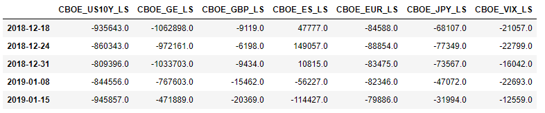

# CFTC-COT
Each Friday the CFTC publishes its Commitment of Traders reports showing long and short positions in financial and commodity futures as of that Tuesday. This script parses historical and current reports into an easy-to-manipulate pandas dataframe. 

Use the last function, "get_CFTC_COT_LS", and specify either "financial" or "commodity" as the sole input. Currently, with "financial" as the input, the function will return net long/short positioning in the following futures contracts:
- 10-year U.S. Treasury Notes
- 3-month Eurodollars
- British pound sterling
- E-Mini S&P 500 stock index
- Euro FX
- Japanese yen
- VIX futures

The "commodity" input will return net positioning in gold and crude oil futures contracts. 

Many other financial and commodity contracts are available; see the long format reports at https://www.cftc.gov/MarketReports/CommitmentsofTraders/index.htm. 

To add other contracts, add the relevant contract names to the dictionary in the function "get_CFTC_COT_LS".

Sample pandas output for the financial futures below:

